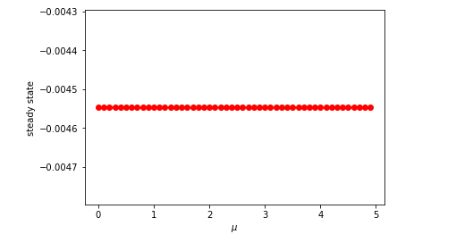
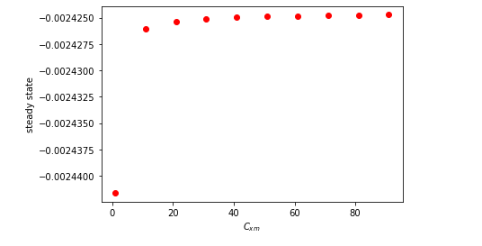

# CHE2241-PROJECT-2

# Analyzing the Kinetic Modeling of Bioproduction of Succinic Acid from Potato Waste

## Reference paper for my analysis

Itziar A. Escanciano, Victoria E. Santos, Ángeles Blanco, Miguel Ladero, (2023) Bioproduction of succinic acid from potato waste. Kinetic modeling, Industrial Crops and Products, Volume 203, 117124, ISSN 0926-6690, https://doi.org/10.1016/j.indcrop.2023.117124. (https://www.sciencedirect.com/science/article/pii/S0926669023008890)

## Background and Motivation for this analysis

To advance the cause of sustainable bioeconomy, it is imperative to explore additional resources. Succinic acid serves as a crucial chemical platform for the establishment of biorefineries, playing a pivotal role in fostering a sustainable bioeconomy. The paper focuses on the anaerobic production of succinic acid by Actinobacillus succinogenes using both potato waste and glucose as substrates. Initially, a straightforward kinetic model was created to precisely forecast the progression of succinic acid, substrate, by-products, and biomass. This modeling was based on bottle experiments conducted at varying initial glucose concentrations. Subsequently, experiments were conducted using an acid hydrolysate of potato waste as a carbon source, both in orbitally shaken bottles and a bioreactor. The purpose was to compare the fermentation performance of potato waste with that of pure glucose. Finally, the developed kinetic model was effectively applied to the fermentation data obtained from potato waste. The aim of my analysis is to validate and potentially enhance the model. The underlying motivation is the recognition of such models as invaluable tools for future techno-economic analyses of bioprocesses. The model presented in the paper has coupled ordinary differential equations as shown below:

### Kinetic models from the selected paper

$$ r_1 = \mu C_x (1-\frac{C_x}{C_{xm}})$$

$$ r_2 = k_{p1}C_sC_x$$

$$ r_2 = k_{p2}C_sC_x$$

$$\frac{dC_s}{dt} =-Y_{S/x}r_1 - Y_{S/p1}r_2 - Y_{S/p2}r_3$$

$$\frac{dC_p}{dt} = r_2 $$

$$\frac{dC_X}{dt} = r_1 $$

$$\frac{dC_{BP}}{dt} = Y_{S/BP}r_2 + r_3$$

Where, $$k_{p1} = \alpha e^{-\beta C_{S0}} $$

Cx = Biomass concentration, Cs = Substrate concentration, Cp = concentartion of product, CBP = Biproduct concentration.

The various parameters reported by the paper are as shown in table 1.0

Table 1.0: Kinetic and statistical parameter values calculated by fitting the kinetic model to 
experimental data of succinic acid production employing potato wastes as carbon source.

Moreover, the plot of the model as reported by the paper is as shown in figure 1.0

*Figure 1.0: Kinetic modeling of succinic acid production employing potato wastes as carbon source.
Data points: Grey = Observe substrate, Red = observed product, orange = observed byproduct, green = observed biomass*

## My analysis

### Model plot replication

Initially, I attempted to recreate the model plot using the parameters documented in the paper. However, the plot, as depicted in Figure 2, exhibits a slight deviation from what was presented in the paper.

*Figure 2.0: The paper Model replication*

However, my analysis centers on the consumption of the substrate (potato) due to its direct correlation with the formation of the target product. I extracted the data points from the author's plot and attempted to align them by employing the reported parameters, as illustrated in Figure 3.

*Figure 3: Data points fitting using the reported parameters*

As evident from the plot, the model does not align well with the data. This prompted me to undertake parameter optimization in order to achieve a more accurate fit for the data.

### Parameters optimization to obtain a better fit

Upon recognizing the disparity between the model and the data points in the paper, I opted to conduct parameter optimization and subsequently refit it using the curve_fit function in the scipy.optimize library. The result is a more accurate fit, as depicted in Figure 4, and the obtained optimized parameters are as follows:

Cxm_opt = 4.8169,  kp2_opt = 0.0062, mu_opt = 1.1744, Y_Sp1_opt = 1.2764, Y_Sp2_opt = 0.4593, Y_SBP_opt = 0.0091, Y_SX_opt = -0.2271, alpha_opt = 0.1368, Beta_opt = 0.0722

*Figure 4: My optimized model fit*

### Bifurcation analysis

To explore qualitative changes in the system's behavior with variations in parameters, I conducted a bifurcation analysis. In the model, key parameters considered for bifurcation analysis include the maximum biomass concentration, which could be crucial, especially if it influences succinic acid selectivity. Additionally, the specific growth rate is a pivotal parameter in microbial growth models, and its variation can lead to different dynamics and potentially reveal bifurcations—qualitative changes in the system's behavior.

Figure 5 illustrates the system's behavior with respect to the two parameters. For the specific growth rate (μ), a continuous straight-line plot is observed, suggesting no significant changes (bifurcation) over the considered range of μ values. Hence, the μ values might not be sufficient to capture any bifurcation behavior. On the other hand, a noticeable variation is observed for the maximum biomass concentration ($C_{xm}$) between its lower and higher range values. Therefore, $C_{xm}$ might potentially influence the system's behavior.

 

*Figure 5: Bifurcation analysis*

### Sensitivity Analysis 

To assess the model's sensitivity to individual parameters, I conducted a local sensitivity analysis by perturbing each parameter's value by 1%. However, at this 1% perturbation level, no distinct changes were observed in the concentration profile. Consequently, I increased the perturbation levels to 5%, 10%, and 20%. It became evident in Figure 6 that, at a 20% perturbation, the concentration profile exhibited greater sensitivity to changes in the maximum biomass concentration ($C_{xm}$).

  

  

*Figure 6: Sensitivity analysis at different pertubations*

Additionally, I conducted a global sensitivity analysis with a 20% perturbation, as illustrated in Figure 7.

*Figure 7: Global sensitivity analysis*

Subsequently, I employed the least squares method to estimate the normalized sensitivities, resulting in the following fitted equation:

$$y =  -3.6057922925340735 C_{xm} - 0.9396265544639332 k_{p2} - 0.3573758933697839 \mu - 2.902837189993309 Y_{Sp1} - 0.543996949750742 Y_{Sp2} - 0.10845026725739992 Y_{SBP} + 0.046694799595708214 Y_{SX}$$

*Figure 8: Estimation of the normalized sensitivities*

Examining the equation, it is evident that $C_{xm}$ has the highest coefficient, affirming the outcome of our sensitivity analysis plot. Hence, it emphasizes the importance of prioritizing efforts on parameterizing the model with a primary focus on $C_{xm}$

## Conclusion

In summary, the analysis undertaken in this study involved the replication and optimization of a kinetic model for the anaerobic production of succinic acid by Actinobacillus succinogenes using potato waste and glucose as substrates. The initial attempt to replicate the model revealed a deviation from the results reported in the paper, prompting a parameter optimization process. The optimized model demonstrated a better fit to the data, as depicted in Figure 4.

Furthermore, a bifurcation analysis was conducted to investigate the qualitative changes in the system's behavior concerning variations in specific growth rate (μ) and maximum biomass concentration (Cxm). The results indicated that Cxm
might significantly affect the system's behavior.

A local sensitivity analysis was performed by perturbing each parameter's value, revealing that, at a 20% perturbation level, the concentration profile was more sensitive to changes in Cxm. This finding was confirmed by a global sensitivity analysis and the fitted equation, where Cxm exhibited the highest coefficient. 

