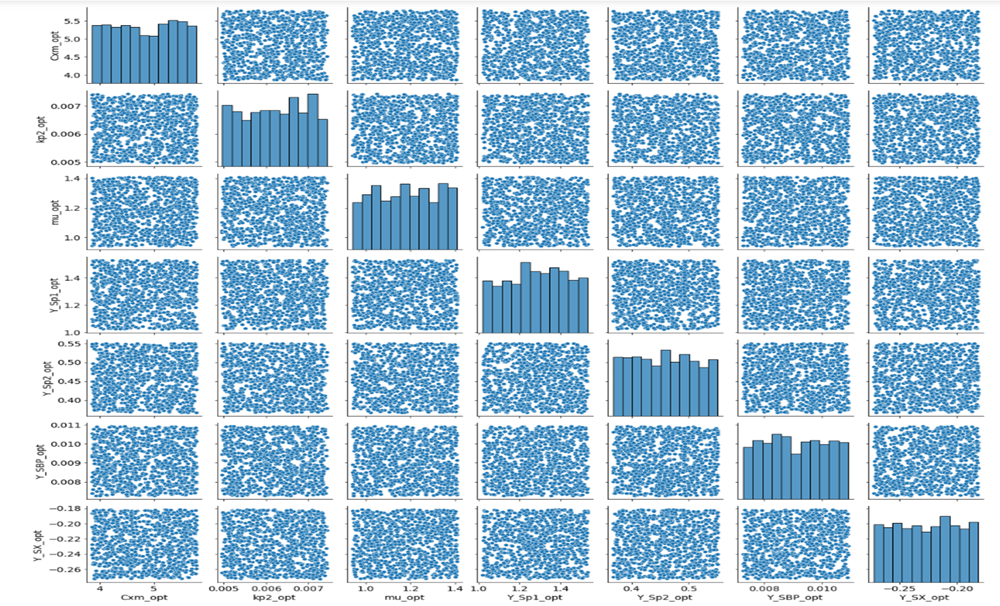

# CHE2241-PROJECT-2

# Analyzing the Kinetic Modeling of Bioproduction of Succinic Acid from Potato Waste

## Reference paper for my analysis

Itziar A. Escanciano, Victoria E. Santos, Ángeles Blanco, Miguel Ladero, (2023) Bioproduction of succinic acid from potato waste. Kinetic modeling, Industrial Crops and Products, Volume 203, 117124, ISSN 0926-6690, https://doi.org/10.1016/j.indcrop.2023.117124. (https://www.sciencedirect.com/science/article/pii/S0926669023008890)

## Background and Motivation for this analysis

To advance the cause of sustainable bioeconomy, it is imperative to explore additional resources. Succinic acid serves as a crucial chemical platform for the establishment of biorefineries, playing a pivotal role in fostering a sustainable bioeconomy. The paper focuses on the anaerobic production of succinic acid by Actinobacillus succinogenes using both potato waste and glucose as substrates. Initially, a straightforward kinetic model was created to precisely forecast the progression of succinic acid, substrate, by-products, and biomass. This modeling was based on bottle experiments conducted at varying initial glucose concentrations. Subsequently, experiments were conducted using an acid hydrolysate of potato waste as a carbon source, both in orbitally shaken bottles and a bioreactor. The purpose was to compare the fermentation performance of potato waste with that of pure glucose. Finally, the developed kinetic model was effectively applied to the fermentation data obtained from potato waste. The aim of my analysis is to validate and potentially enhance the model. The underlying motivation is the recognition of such models as invaluable tools for future techno-economic analyses of bioprocesses. The model presented in the paper has coupled ordinary differential equations as shown below:

### Kinetic models from the selected paper

$$ r_1 = \mu C_x (1-\frac{C_x}{C_{xm}})$$

$$ r_2 = k_{p1}C_sC_x$$

$$ r_2 = k_{p2}C_sC_x$$

$$\frac{dC_s}{dt} =-Y_{S/x}r_1 - Y_{S/p1}r_2 - Y_{S/p2}r_3$$

$$\frac{dC_p}{dt} = r_2 $$

$$\frac{dC_X}{dt} = r_1 $$

$$\frac{dC_{BP}}{dt} = Y_{S/BP}r_2 + r_3$$

Where, $$k_{p1} = \alpha e^{-\beta C_{S0}} $$

Cx = Biomass concentration, Cs = Substrate concentration, Cp = concentartion of product, CBP = Biproduct concentration.

The various parameters reported by the paper are as shown in table 1.0

Table 1.0: Kinetic and statistical parameter values calculated by fitting the kinetic model to 
experimental data of succinic acid production employing potato wastes as carbon source.

Moreover, the plot of the model as reported by the paper is as shown in figure 1.0

*Figure 1.0: Kinetic modeling of succinic acid production employing potato wastes as carbon source.
Data points: Grey = Observe substrate, Red = observed product, orange = observed byproduct, green = observed biomass*

## My analysis

### Model plot replication

Firstly, I tried to replicate the model plot using the parameters reported in the paper. The plot as shown in figure 2 slightly deviate from what they obtained in the paper.

*Figure 2.0: The paper Model replication*

However, my analysis focuses on the substrate (potato) consumption since it has direct relationship with formation of the target product. I extracted the data point in the plot presented by the author, and tried to fit it using the reported parameters as shown in figure 3.

*Figure 3: Data points fitting using the reported parameters*

It can be seen from the plot, that the model does not fit the data very well. This motivates me to carry out optimization of the parameters to obtain a better fit of the data.

### Parameters optimization to obtain a better fit

After realizing the deviation of the model and the data points in the paper, I decided to perform optimization of the parameters and fit it again using curve_fit in the scipy.optimize library. I obtained a better fit as seen in figure 4, with the following optimized parameters:

Cxm_opt = 4.8169,  kp2_opt = 0.0062, mu_opt = 1.1744, Y_Sp1_opt = 1.2764, Y_Sp2_opt = 0.4593, Y_SBP_opt = 0.0091, Y_SX_opt = -0.2271, alpha_opt = 0.1368, Beta_opt = 0.0722

*Figure 4: My optimized model fit*

### Sensitivity Analysis 

To test the model's sensitivity to each of the parameters, I performed a local sensitivity analysis by pertubation of the parameters value by 1%. At 1% pertubation I could not observe a distinct behaviour of the concentration profile, therefore I further increased the pertubation to 5%, 10% and 20%. At 20% we could see clearly that the concentration profile is more sensitive to the maximum biomass concentration (Cxm).

  

  

*Figure 5: Sensitivity analysis at different pertubations*

Further, I carried out the global sensitivity analysis by 20% pertubation as shown in figure 6.

*Figure 6: Global sensitivity analysis*

I then used least squares to estimate the normslized sensitivities, which gave me the following fitted equation:

y =  -3.6057922925340735 Cxm_opt +  -0.9396265544639332 kp2_opt + -0.3573758933697839 mu_opt -2.902837189993309 Y_Sp1_opt -0.543996949750742 Y_Sp2_opt - 0.10845026725739992 Y_SBP_opt + 0.046694799595708214 Y_SX_opt

From the equation also, it could be seen that, the Cxm has the greatest coefficient, which confirm the result of our sensitivity analysis plot. Therefore most effort should focus on Cxm in terms of parameterizing the model.

